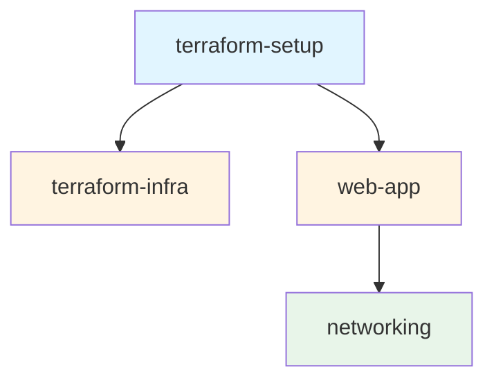
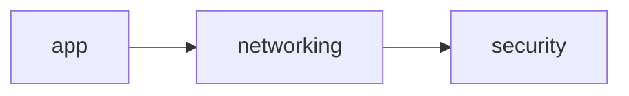

# Dependencies

The nx-terraform plugin automatically manages dependencies between Terraform projects. Understanding how dependencies work is crucial for proper infrastructure deployment ordering and project organization.

## Overview

Dependencies in nx-terraform work at two levels:

1. **Project Dependencies** - Relationships between projects
2. **Target Dependencies** - Execution order within projects

Both are managed automatically by the plugin.

## Automatic Dependency Detection

The plugin automatically detects and creates dependencies in two ways:

### 1. Backend Project Dependencies

Projects with `terraform-init.metadata.backendProject` automatically depend on their backend project.

**Example:**

```json
{
  "root": "packages/my-infra",
  "projectType": "application",
  "targets": {
    "terraform-init": {
      "metadata": { "backendProject": "terraform-setup" }
    }
  }
}
```

This creates: `my-infra` → `terraform-setup`

**Why:** The backend must be applied before stateful projects can initialize.

### 2. Module Reference Dependencies

The plugin analyzes `.tf` files to detect module references using local paths.

**How It Works:**

1. Scans `.tf` files for `module` blocks
2. Extracts `source` attributes with local paths (`./` or `../`)
3. Matches the last path segment to project names
4. Creates static dependencies

**Example:**

```hcl
# In packages/web-app/main.tf
module "networking" {
  source = "../../packages/networking"
  vpc_cidr = "10.0.0.0/16"
}
```

This creates: `web-app` → `networking`

## Project Dependencies

### Viewing Dependencies

View project dependencies:

```bash
nx show project my-infra --json | jq '.implicitDependencies'
```

View the dependency graph:

```bash
nx graph
```

### Dependency Types

#### Static Dependencies

Created from:
- `terraform-init.metadata.backendProject`
- Module references in Terraform code

These are always present and don't change based on execution.

#### Dynamic Dependencies

Created at runtime based on:
- Target execution order
- Task dependencies

These can vary based on what you're running.

## Target Dependencies

Targets have their own dependencies to ensure proper execution order:

### terraform-init

```json
{
  "dependsOn": ["^terraform-apply"]
}
```

**Meaning:** Depends on `terraform-apply` from dependencies (backend must be applied first).

### terraform-plan

```json
{
  "dependsOn": ["terraform-init"]
}
```

**Meaning:** Requires `terraform-init` to run first.

### terraform-apply

```json
{
  "dependsOn": ["terraform-plan"]
}
```

**Meaning:** Requires `terraform-plan` to run first.

### terraform-validate

```json
{
  "dependsOn": ["terraform-init"]
}
```

**Meaning:** Requires `terraform-init` to run first.

### terraform-destroy

```json
{
  "dependsOn": ["terraform-init"]
}
```

**Meaning:** Requires `terraform-init` to run first.

### terraform-output

```json
{
  "dependsOn": ["terraform-init"]
}
```

**Meaning:** Requires `terraform-init` to run first.

## Dependency Graph Example

Consider this workspace:

```
terraform-setup (backend)
    ↑
    │
terraform-infra (stateful, uses backend)
    ↑
    │
web-app (stateful, uses backend, references networking module)
    ↑
    │
networking (library module)
```

### Visual Representation



### Execution Order

When running `nx run-many --target=terraform-apply --all`:

1. `terraform-setup` applies first (no dependencies)
2. `networking` validates (no state, just validation)
3. `terraform-infra` initializes (backend ready)
4. `web-app` initializes (backend ready, networking validated)

## Dependency Chains

Dependencies can form chains:



**Example:**

```hcl
# packages/app/main.tf
module "networking" {
  source = "../../networking"
}

# packages/networking/main.tf
module "security" {
  source = "../../security"
}
```

Creates: `app` → `networking` → `security`

## Circular Dependencies

Circular dependencies are problematic and should be avoided.

### Example of Circular Dependency

```hcl
# packages/app-a/main.tf
module "app-b" {
  source = "../../app-b"
}

# packages/app-b/main.tf
module "app-a" {
  source = "../../app-a"
}
```

This creates: `app-a` → `app-b` → `app-a` (circular!)

### Solutions

1. **Extract Common Code**: Create a shared module
2. **Use Data Sources**: Instead of module references
3. **Restructure**: Break the circular dependency

## Dependency Resolution

### Automatic Resolution

Nx automatically resolves dependencies:
- Ensures dependencies run first
- Handles parallel execution when possible
- Detects circular dependencies

### Manual Override

You can manually add dependencies in `project.json`:

```json
{
  "implicitDependencies": ["another-project"]
}
```

However, this is usually not necessary as the plugin handles it automatically.

## Best Practices

### 1. Clear Dependency Structure

- Keep dependencies shallow when possible
- Avoid deep dependency chains
- Use clear naming

### 2. Module Organization

- Create reusable modules for shared code
- Reference modules explicitly
- Document module dependencies

### 3. Backend Management

- One backend per workspace (or environment)
- Clear backend → infrastructure relationships
- Document backend dependencies

### 4. Avoid Circular Dependencies

- Design modules to avoid cycles
- Use data sources for cross-references
- Extract common code to shared modules

## Viewing Dependencies

### Command Line

```bash
# View project dependencies
nx show project my-infra

# View all projects
nx show projects

# View dependency graph
nx graph
```

### JSON Output

```bash
nx show project my-infra --json | jq '.implicitDependencies'
```

### Visual Graph

```bash
nx graph
```

Opens a visual representation in your browser.

## Troubleshooting

## Troubleshooting

For dependency-related issues, see the [Troubleshooting Guide](/docs/guides/troubleshooting#dependency-issues).

## Related Topics

- [Project Types](/docs/guides/project-types) - Learn about project types and their dependencies
- [Project Discovery](/docs/guides/project-discovery) - Understand how projects are discovered
- [Tutorial 2: Add a reusable module](/docs/tutorials/tutorial-02-setup-backend) - Learn about module dependencies

