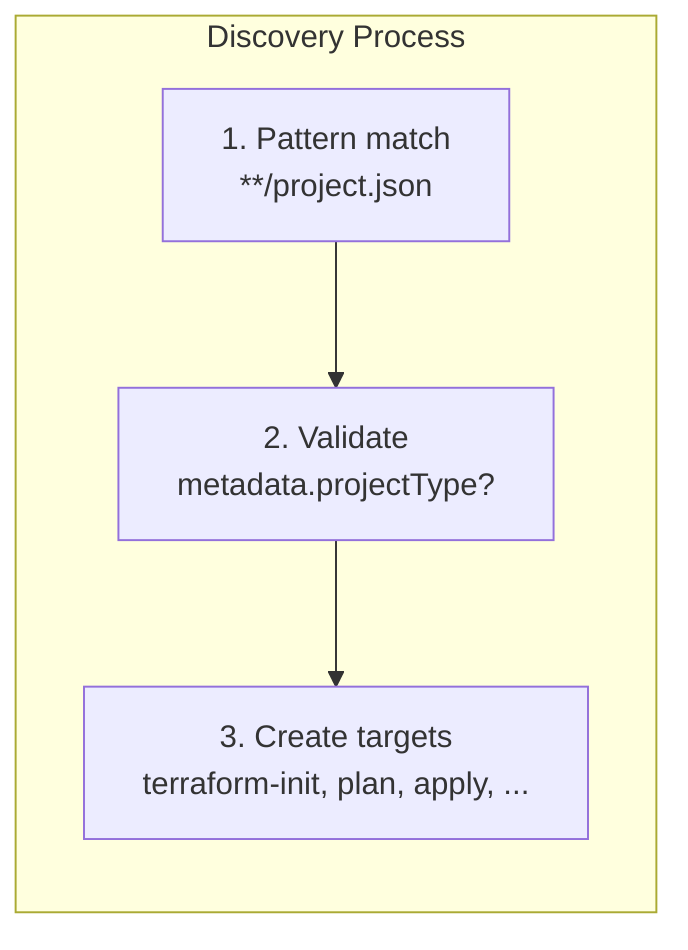

# Project Discovery

The nx-terraform plugin automatically discovers Terraform projects in your workspace. Understanding how discovery works helps you organize your projects correctly and troubleshoot discovery issues.

## Overview

Project discovery happens automatically when Nx loads your workspace. The plugin scans for Terraform projects and creates targets for each discovered project.

## Discovery Process



### Step 1: Pattern Matching

The plugin looks for files matching:
```
**/project.json
```

This pattern finds all `project.json` files recursively in your workspace.

### Step 2: Project Validation

For each `project.json` file found, the plugin checks:

1. **Terraform metadata**: Does the project have `metadata['nx-terraform'].projectType` set?
2. **Project type value**: One of `backend`, `stateful`, or `module` (used to determine which targets to create)

Projects without this metadata are skipped (not considered Terraform projects by the plugin).

### Step 3: Target Creation

If validation passes, the plugin creates Terraform targets:
- `terraform-init`
- `terraform-plan`
- `terraform-apply`
- `terraform-destroy`
- `terraform-validate`
- `terraform-fmt`
- `terraform-output`

## Discovery Requirements

### Required Configuration

For a project to be discovered as a Terraform project:

1. **project.json** - Must exist (discovery is triggered by this file).
2. **metadata['nx-terraform'].projectType** - Must be set in `project.json` to one of:
   - `backend` - Backend (state storage) project
   - `stateful` - Stateful project (uses a backend)
   - `module` - Reusable module project

Projects are created by the plugin generators (`terraform-backend`, `terraform-module`) or by manually adding this metadata. The plugin does not scan for `main.tf`; it only considers projects that already have `project.json` with the nx-terraform metadata.

### Project Structure

```
packages/
  └── my-terraform-project/
      ├── project.json          # Required; must include metadata['nx-terraform'].projectType
      ├── main.tf               # Required for valid Terraform usage (not for discovery trigger)
      ├── backend.tf            # Optional
      ├── provider.tf          # Optional
      └── variables.tf          # Optional
```

## Project Type Detection

The plugin determines project type from `project.json`:

### Backend Project

```json
{
  "projectType": "application",
  "root": "packages/terraform-setup"
}
```

Backend projects do not set `terraform-init.backendProject` (they are the backend).

### Stateful Project

```json
{
  "projectType": "application",
  "root": "packages/my-infra",
  "targets": {
    "terraform-init": {
      "metadata": { "backendProject": "terraform-setup" }
    }
  },
  "metadata": {
    "nx-terraform": { "projectType": "stateful" }
  }
}
```

(Alternatively, `metadata['nx-terraform'].projectType` can be `module` with `backendProject` set; the plugin then assigns stateful targets.)

### Module Project

```json
{
  "projectType": "application",
  "root": "packages/networking",
  "metadata": {
    "nx-terraform": { "projectType": "module" }
  }
}
```

Module projects do not set `terraform-init.metadata.backendProject`.

## Discovery Patterns

### Standard Pattern

Most common structure:

```
packages/
  ├── terraform-setup/      # Backend project
  │   ├── project.json
  │   └── main.tf
  └── my-infra/             # Stateful project
      ├── project.json
      └── main.tf
```

### Nested Projects

Projects can be nested:

```
packages/
  └── infrastructure/
      ├── backend/
      │   ├── project.json
      │   └── main.tf
      └── frontend/
          ├── project.json
          └── main.tf
```

### Monorepo Structure

Works with any monorepo structure:

```
apps/
  └── terraform-app/
      ├── project.json
      └── main.tf

libs/
  └── terraform-lib/
      ├── project.json
      └── main.tf
```

## Verification

### Check Discovered Projects

```bash
nx show projects
```

Should list all Terraform projects.

### View Project Details

```bash
nx show project my-terraform-project
```

Shows project configuration and targets.

### View Project Graph

```bash
nx graph
```

Visual representation of all projects and dependencies.

## Troubleshooting

For project discovery issues, see the [Troubleshooting Guide](/docs/guides/troubleshooting#project-discovery-issues).

## Discovery Configuration

### Plugin Registration

The plugin must be registered in `nx.json`:

```json
{
  "plugins": [
    {
      "plugin": "nx-terraform",
      "options": {}
    }
  ]
}
```

### Pattern Customization

The discovery pattern is hardcoded to `**/project.json`. This cannot be customized currently.

## Best Practices

### 1. Consistent Structure

- Ensure `project.json` has `metadata['nx-terraform'].projectType` set (use generators or add manually)
- Keep `main.tf` and other Terraform files in the project root
- Use consistent directory structure and naming conventions

### 2. Clear Naming

- Use descriptive project names
- Match directory names to project names
- Avoid special characters

### 3. Organization

- Group related projects
- Use clear directory structure
- Document project purposes

### 4. Validation

- Verify projects are discovered after creation
- Check targets are created correctly
- Test project dependencies

## Discovery Timing

### When Discovery Happens

- **Workspace Load**: When Nx loads the workspace
- **File Changes**: When files are added/modified (with Nx daemon)
- **Manual Refresh**: Using `nx reset` or restarting Nx

### Discovery Performance

- **Fast**: Pattern matching is efficient
- **Cached**: Results are cached by Nx
- **Incremental**: Only scans changed areas

## Manual Project Creation

If a project isn't discovered as a Terraform project:

1. **Create or update project.json** with Terraform metadata:
   ```json
   {
     "root": "packages/my-project",
     "projectType": "application",
     "metadata": {
       "nx-terraform": { "projectType": "module" }
     }
   }
   ```
   Use `backend` for a backend project, `stateful` for a stateful project, or `module` for a reusable module. For stateful projects, add `targets["terraform-init"].metadata.backendProject` pointing to your backend project.

2. **Add Terraform files** (e.g. `main.tf`) as needed for your project.

3. **Verify discovery:**
   ```bash
   nx show projects
   ```

## Related Topics

- [Project Types](/docs/guides/project-types) - Learn about different project types
- [Installation](/docs/getting-started/installation) - Plugin installation and setup
- [Generators](/docs/reference/generators/init) - Use generators to create projects correctly

