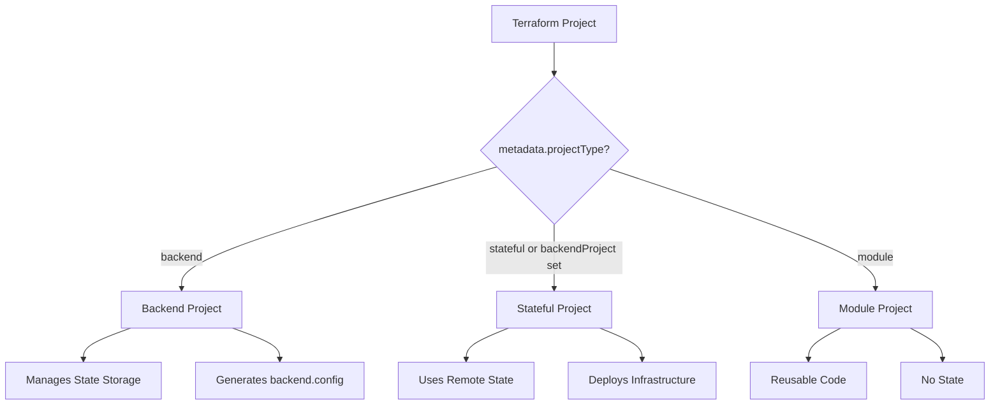

# Project Types

The nx-terraform plugin supports three types of Terraform projects, each with different characteristics and use cases. Understanding these types is crucial for organizing your infrastructure code effectively.

## Overview

Terraform projects in nx-terraform are classified based on:
- **Metadata**: `metadata['nx-terraform'].projectType` in `project.json` (`backend`, `stateful`, or `module`)
- **Backend configuration**: Presence of `targets['terraform-init'].metadata.backendProject`
- **State management**: Whether the project manages state

All Terraform projects use `projectType: 'application'` in `project.json`; the plugin uses `metadata['nx-terraform'].projectType` to distinguish backend, stateful, and module behavior.



## Backend Projects

Backend projects manage the remote state storage infrastructure itself.

### Characteristics

- **Project Type**: `application`
- **Metadata**: `metadata['nx-terraform'].projectType: 'backend'`
- **Backend config**: No `terraform-init.metadata.backendProject` (it's a backend itself)
- **State Management**: Manages its own state (typically local, even for remote backends)
- **Purpose**: Creates and manages state storage (S3 bucket, DynamoDB table, etc.)
- **Output**: Generates `backend.config` file for other projects to use

### Example Configuration

```json
{
  "root": "packages/terraform-setup",
  "projectType": "application",
  "metadata": {
    "nx-terraform": { "projectType": "backend" }
  },
  "targets": {
    "terraform-init": { ... },
    "terraform-apply": { ... }
  }
}
```

### Use Cases

- Creating S3 buckets for state storage
- Setting up DynamoDB tables for state locking
- Managing backend infrastructure lifecycle

### Caching Behavior

- **terraform-init**: Cached (backend projects don't depend on external state)
- **terraform-plan**: Cached
- **terraform-apply**: Cached
- **terraform-validate**: Cached
- **terraform-fmt**: Cached

## Stateful Projects

Stateful projects are infrastructure projects that use remote state storage.

### Characteristics

- **Project Type**: `application`
- **Metadata**: `metadata['nx-terraform'].projectType: 'stateful'` (or `module` with backendProject set)
- **Backend config**: Has `targets['terraform-init'].metadata.backendProject` pointing to a backend project
- **State Management**: Uses remote state via the backend project
- **Purpose**: Deploys actual infrastructure (servers, networks, databases, etc.)
- **State Location**: Stored in the backend (S3, local file, etc.)

### Example Configuration

```json
{
  "root": "packages/my-infra",
  "projectType": "application",
  "targets": {
    "terraform-init": {
      "metadata": { "backendProject": "terraform-setup" }
    }
  },
  "metadata": {
    "nx-terraform": { "projectType": "stateful" }
  }
}
```

(Additional Terraform targets are inferred by the plugin.)

### Use Cases

- Deploying application infrastructure
- Managing environment-specific resources
- Creating production systems

### Caching Behavior

- **terraform-init**: Not cached (state-dependent, requires backend access)
- **terraform-plan**: Not cached (state-dependent, shows infrastructure changes)
- **terraform-apply**: Not cached (state-dependent, modifies infrastructure)
- **terraform-validate**: Cached (validation results can be cached)
- **terraform-fmt**: Cached (code formatting is deterministic)

### Backend Connection

Stateful projects connect to backends via `backend.tf`:

```hcl
terraform {
  backend "s3" {
    config_file = "../../terraform-setup/backend.config"
  }
}
```

## Module Projects

Module projects are reusable Terraform modules without state management.

### Characteristics

- **Project Type**: `application` (in `project.json`)
- **Metadata**: `metadata['nx-terraform'].projectType: 'module'`
- **Backend metadata**: No `terraform-init.metadata.backendProject` (modules don't have state)
- **State management**: None (modules are included in other projects)
- **Purpose**: Reusable Terraform code that can be referenced by other projects
- **Execution**: Validated and formatted, but not applied independently (stub targets)

### Example Configuration

```json
{
  "root": "packages/networking",
  "projectType": "application",
  "metadata": {
    "nx-terraform": { "projectType": "module" }
  },
  "targets": {
    "terraform-validate": { ... },
    "terraform-fmt": { ... }
  }
}
```

### Use Cases

- Shared infrastructure patterns
- Reusable component libraries
- Common configurations

### Caching Behavior

- **terraform-fmt**: Cached
- **terraform-validate**: Cached
- **terraform-apply**: Not cached (though modules typically don't use apply)
- All other targets are stubs (cached but no-op)

### Module Reference

Other projects reference library modules:

```hcl
module "networking" {
  source = "../../networking"
  vpc_cidr = "10.0.0.0/16"
}
```

## Project Type Comparison

| Feature | Backend Project | Stateful Project | Module Project |
|---------|----------------|------------------|----------------|
| **projectType** | `application` | `application` | `application` |
| **metadata.projectType** | `backend` | `stateful` | `module` |
| **Has Backend** | No (is backend) | Yes (via backendProject) | No |
| **Manages State** | Yes (own state) | Yes (remote state) | No |
| **Can Be Applied** | Yes | Yes | No (stub; included in others) |
| **Generates backend.config** | Yes | No | No |
| **Caching (init/plan/apply)** | Enabled | Disabled | N/A (stubs) |
| **Use Case** | State storage | Infrastructure | Reusable code |

## Choosing the Right Type

### When to Use Backend Projects

- You need to manage state storage infrastructure
- You're setting up a new workspace
- You want to create S3 buckets or DynamoDB tables for state

### When to Use Stateful Projects

- You're deploying actual infrastructure
- You need state management
- You want to track infrastructure changes over time

### When to Use Module Projects

- You have reusable Terraform code
- You want to share infrastructure patterns
- You need to avoid code duplication

## Project Structure

### Backend Project Structure

```
packages/terraform-setup/
├── project.json          # application, no backendProject
├── main.tf              # Backend infrastructure
├── backend.tf          # Backend config (local or s3)
├── provider.tf
├── variables.tf
└── backend.config       # Generated after apply
```

### Stateful Project Structure

```
packages/my-infra/
├── project.json          # application, terraform-init.metadata.backendProject: "terraform-setup"
├── main.tf              # Infrastructure code
├── backend.tf          # References backend project
├── provider.tf
├── variables.tf
├── outputs.tf
└── tfvars/
    ├── dev.tfvars
    └── prod.tfvars
```

### Module Project Structure

```
packages/networking/
├── project.json          # application + metadata['nx-terraform'].projectType: 'module'
├── main.tf              # Module code
├── variables.tf         # Module inputs
├── outputs.tf           # Module outputs
└── README.md            # Module documentation
```

## Converting Between Types

### Converting Module to Stateful

To convert a module to a stateful project:

1. Set `metadata['nx-terraform'].projectType` to `stateful`
2. Add `targets['terraform-init'].metadata.backendProject` pointing to your backend project
3. Add `backend.tf` file
4. Update project structure as needed

### Converting Stateful to Module

To convert a stateful project to a module:

1. Set `metadata['nx-terraform'].projectType` to `module`
2. Remove `targets['terraform-init'].metadata.backendProject` (or the whole terraform-init metadata)
3. Remove `backend.tf` file
4. Ensure it's designed for reuse

## Best Practices

### 1. Clear Naming

Use descriptive names that indicate project type:
- Backend: `terraform-setup`, `state-backend`
- Stateful: `web-infra`, `api-infra`, `prod-infra`
- Module: `networking`, `security`, `compute`

### 2. Separation of Concerns

- Keep backends separate from infrastructure
- Use modules for reusable patterns
- Keep stateful projects focused on specific infrastructure

### 3. Documentation

Document project types in README files:
- Explain the project's purpose
- Document dependencies
- Provide usage examples

## Related Topics

- [Backend Types](/docs/guides/backend-types) - Learn about different backend options
- [Dependencies](/docs/guides/dependencies) - Understand how projects depend on each other
- [Project Discovery](/docs/guides/project-discovery) - Learn how projects are discovered

