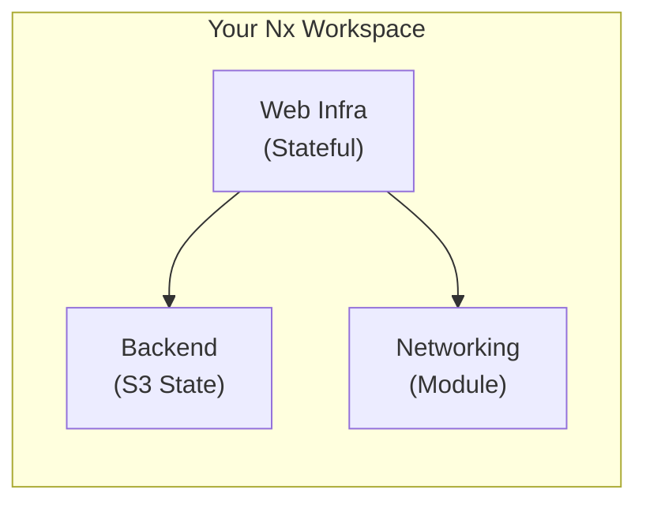
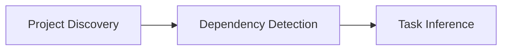

# Introduction

**nx-terraform** is an [Nx](https://nx.dev) plugin for managing Terraform projects within an Nx monorepo. This plugin provides generators, automatic project discovery, and inferred tasks for Terraform infrastructure-as-code projects.

## The Problem

Managing infrastructure-as-code in modern development environments presents several challenges:

- **Manual Dependency Tracking** - Terraform modules reference each other, but you manually track which modules depend on what
- **No Caching** - Every Terraform operation runs from scratch, even when nothing changed
- **Isolated from Application Code** - Infrastructure lives in separate repositories, making it hard to keep in sync with applications
- **Complex Multi-Environment Management** - Managing dev, staging, and production requires duplicate configurations and careful orchestration
- **Poor Visibility** - No easy way to visualize infrastructure dependencies and relationships
- **Repetitive Operations** - Running the same commands across multiple modules is tedious and error-prone

## The Solution

nx-terraform brings Terraform into your Nx monorepo, unlocking:



- **Automatic Dependencies Detected**
- **Smart Caching Applied**

**One command to see everything:**
```bash
nx graph  # Visualize your entire infrastructure dependency graph
```

## What is nx-terraform?

The `nx-terraform` plugin enables you to manage Terraform projects alongside your other code in an Nx monorepo. It bridges the gap between infrastructure-as-code and application code, allowing you to:

- **Discover Terraform projects automatically** - No manual configuration needed
- **Use Nx commands** - Run Terraform operations through familiar Nx targets
- **Manage dependencies** - Automatic dependency detection between Terraform projects
- **Leverage Nx caching** - Speed up your infrastructure workflows with intelligent caching
- **Maintain consistency** - Keep all your code, including infrastructure, in one monorepo

## Key Features

### Automatic Project Discovery

The plugin automatically discovers Terraform projects by scanning `project.json` files that have `metadata['nx-terraform'].projectType` set. Learn more in the [Project Discovery Guide](/docs/guides/project-discovery).

### Inferred Tasks

The plugin automatically creates these targets for each Terraform project:

- **terraform-init**: Initialize Terraform workspace
- **terraform-plan**: Create execution plan
- **terraform-apply**: Apply changes to infrastructure
- **terraform-destroy**: Destroy infrastructure
- **terraform-validate**: Validate Terraform configuration
- **terraform-fmt**: Format Terraform code
- **terraform-output**: Show Terraform outputs

### Smart Dependencies

Automatic dependency management between Terraform projects ensures proper execution order:

- **Backend Dependencies**: Projects with backends automatically depend on their backend project
- **Module References**: Module references in Terraform code are automatically detected and create project dependencies
- **Target Dependencies**: Targets have their own dependencies (e.g., init before plan, plan before apply)

### Intelligent Caching

Intelligent caching speeds up safe operations while ensuring state-dependent operations always run. Learn more in the [Caching Guide](/docs/guides/caching).

## Quick Example

See how easy it is to work with Terraform in Nx:

```bash
# Create workspace with Terraform support
npx create-nx-terraform-app my-infrastructure

# Nx discovers projects and understands dependencies automatically
nx show projects
# terraform-setup
# terraform-infra

# View dependency graph
nx graph

# Run Terraform operations through Nx
nx run terraform-infra:terraform-plan   # Fast with caching
nx run terraform-infra:terraform-apply  # Apply changes

# Run across all projects
nx run-many --target=terraform-validate
```

**Before nx-terraform:**
```bash
cd terraform/modules/networking
terraform init
terraform plan
cd ../web-app
terraform init  # Repeat for each module
terraform plan  # No caching, always slow
# Manual tracking: "Did I deploy networking first?"
```

**After nx-terraform:**
```bash
nx run web-app:terraform-plan  # Nx handles dependencies and caching
```

## Who Is This For?

**Perfect for:**
- Teams managing infrastructure in monorepos
- Organizations with multiple environments (dev, staging, prod)
- Projects with shared infrastructure modules
- Teams wanting infrastructure visibility in their code graph
- Projects where infrastructure and application code evolve together

**Not ideal for:**
- Single Terraform file projects (use Terraform CLI directly)
- Teams not using Nx workspaces
- Infrastructure completely isolated from application code

## Use Cases

### Monorepo Infrastructure Management

Manage all your infrastructure code alongside your application code in a single Nx monorepo. This provides:

- **Unified versioning** - Infrastructure and application code in the same repository
- **Atomic changes** - Update infrastructure and application code in the same commit
- **Shared dependencies** - Infrastructure modules can be shared across projects
- **Consistent tooling** - Use the same Nx commands for everything
- **Better visibility** - See infrastructure dependencies in the Nx graph
- **Code generation** - Generate infrastructure alongside application scaffolding

### Multi-Environment Deployments

Easily manage multiple environments (dev, staging, prod) with:

- **Environment-specific modules** - Separate projects for each environment
- **Configuration files** - Use `tfvars` files for environment-specific variables
- **Dependency management** - Ensure proper deployment order across environments
- **Shared backend** - One S3 bucket for all environments with separate state files
- **Progressive rollout** - Test in dev, validate in staging, deploy to prod

### Reusable Infrastructure Modules

Create reusable Terraform modules that can be shared across projects:

- **Library modules** - Reusable Terraform code without state
- **Automatic dependencies** - Module references create automatic project dependencies
- **Version control** - Track module versions alongside consuming projects
- **Testing** - Validate modules independently with caching
- **Composition** - Combine modules to build complex infrastructure

## How It Works

nx-terraform operates through three key mechanisms:



### 1. Project Discovery
The plugin scans your workspace for `project.json` files with Terraform metadata:

```json
{
  "name": "web-infra",
  "metadata": {
    "nx-terraform": {
      "projectType": "stateful"
    }
  }
}
```

No manual registration needed—projects with `project.json` and Terraform metadata are discovered automatically.

### 2. Dependency Detection
Dependencies are detected automatically from two sources:

**Backend Dependencies** - Read from project configuration:
```json
{
  "targets": {
    "terraform-init": {
      "metadata": { "backendProject": "terraform-setup" }
    }
  }
}
```

**Module Dependencies** - Parsed from Terraform code:
```hcl
module "networking" {
  source = "../networking"  # Creates dependency: web-infra → networking
}
```

### 3. Task Inference
Seven Terraform targets are automatically created for each project:
- `terraform-init`, `terraform-plan`, `terraform-apply`
- `terraform-destroy`, `terraform-validate`, `terraform-fmt`, `terraform-output`

Each target is configured with appropriate caching behavior based on project type.

## Project Types

The plugin supports three types of Terraform projects: **Backend Projects**, **Stateful Projects**, and **Module Projects**. Learn more about [Project Types](/docs/guides/project-types).

## Choose Your Path

### Quick Start (5 minutes)
Want to get running fast? Follow the [Quick Start Guide](/docs/getting-started/quick-start) for a minimal setup.

### Step-by-Step Tutorials
Follow the [Tutorial Series](/docs/tutorials/tutorial-01-create-workspace): create & run (T1) → add a reusable module (T2) → multiple envs with tfvars and target configurations (T3). Optional: separate projects per env (T4), more modules and chains (T5).

### Reference Documentation
Need specific information? Check the [Reference Documentation](/docs/reference/generators/init) for generators and targets.

### For Existing Workspaces
Adding Terraform to an existing Nx workspace? Start with [Installation](/docs/getting-started/installation).

## Resources

- [Nx Documentation](https://nx.dev)
- [Terraform Documentation](https://developer.hashicorp.com/terraform/docs)
- [GitHub Repository](https://github.com/alexpialetski/nx-terraform)
- [npm Package](https://www.npmjs.com/package/nx-terraform)

## License

MIT
